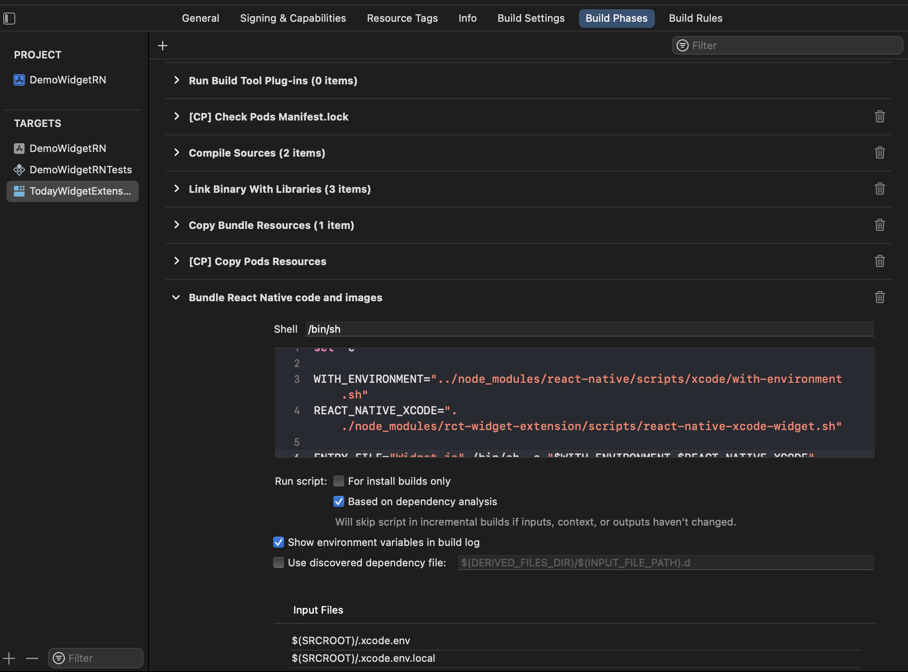

## Usage

This package is not on NPM yet, so you have to install it manually.

>IMPORTANT: This package is only for iOS and only available on new architecture (Fabric). 
### Installation

- Clone the repository and run `yarn` or `yarn install` in the root directory.
- Run `npm pack` in the root directory to build the package, copy and paste that tarball in your project and run the following command from the root of your project:

```bash
yarn add ./rct-widget-extension-0.1.0.tgz
```

- Once installation is completed, run the following command from the root of your project:

```bash
yarn setup_widget
```

> This will add the required files in your project and also add the required dependencies.

- Finally, run the following command from the root of your project:

```bash
cd ios && RCT_NEW_ARCH_ENABLED=1 bundle exec pod install
```

- For Release builds, you need to add the following build phase script in your Widget Extension target ( See the below screenshot ):

```bash
set -e

WITH_ENVIRONMENT="../node_modules/react-native/scripts/xcode/with-environment.sh"
REACT_NATIVE_XCODE="../node_modules/rct-widget-extension/scripts/react-native-xcode-widget.sh"

ENTRY_FILE="Widget.js" /bin/sh -c "$WITH_ENVIRONMENT $REACT_NATIVE_XCODE"

```



>NOTE: This above step is only temporary, with future efforts we will remove this step.